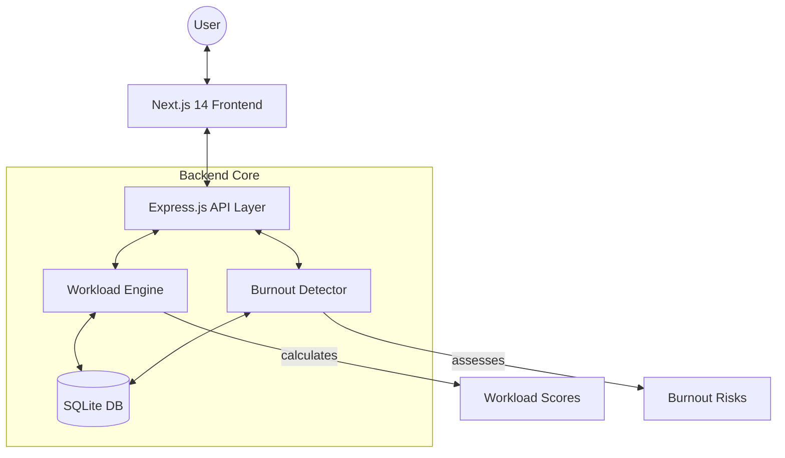

# 🛡️ SEAPM: Employee Task Overload & Burnout Detection System

[](LICENSE)
[](https://nextjs.org/)
[](https://nodejs.org/)
[](https://sqlite.org/)

**SEAPM** (Smart Employee Analytics & Performance Management) is a high-end, data-driven platform designed to prioritize employee wellbeing while optimizing organizational productivity. By leveraging advanced workload scoring and longitudinal burnout detection algorithms, SEAPM provides actionable insights to prevent overwork before it impacts team health.

---

## 🏛️ System Architecture

SEAPM follows a modern decoupled architecture designed for speed and clarity:



---

## ✨ Key Features

### 👤 For Employees
*   **Intelligent Dashboard**: Real-time visualization of workload components and risk trends.
*   **Smart Task Tracking**: Interactive task management with automatic impact calculation.
*   **Wellbeing Alerts**: Proactive notifications when workload reaches critical thresholds.
*   **Predictive Assessment**: Personalized burnout risk evaluation based on recent work patterns.

### 👥 For Managers
*   **Team Pulse Overview**: Monitor team-wide workload distribution at a glance.
*   **High-Risk Identification**: Instant detection of team members approaching burnout.
*   **Strategic Redistribution**: Data-driven task assignment to balance load across the team.
*   **Performance Analytics**: Historical trends and performance correlate for proactive management.

### 🔐 For Administrators
*   **Enterprise Insights**: Organization-wide health metrics and departmental comparisons.
*   **Global Configuration**: Fine-tune workload thresholds and scoring weights.
*   **Security & Audit**: Comprehensive user management with role-based access control (RBAC).

---

## 🧠 Core Intelligence

### 📊 Workload Scoring Engine
The system calculates a normalized **Workload Score (0-100)** using a multi-factor weighted algorithm:

| Factor | Weight | Description |
| :--- | :--- | :--- |
| **Task Volume** | 25% | Number of active/pending tasks relative to capacity. |
| **Priority Load** | 25% | Intensity of high-priority responsibilities. |
| **Deadline Pressure** | 25% | Proximity and clustering of upcoming deadlines (30pts for overdue, 15pts for due soon). |
| **Capacity Hours** | 25% | Estimated weekly effort vs. the 40-hour standard threshold. |

> [!TIP]
> **Risk Levels**: `Low (<40)`, `Medium (40-69)`, `High (>=70)`

### 🔥 Burnout Detection Logic
Unlike static metrics, the **Burnout Risk Assessment** analyzes longitudinal patterns over a rolling 7-day window:
1.  **Persistence**: Tracks consecutive days spent in "High Risk" workload territory.
2.  **Trend-line**: Identifies worsening workload directions (Score ∆ > 20).
3.  **Backlog Build-up**: Monitors accumulation of overdue tasks.
4.  **Clustering**: Detects "deadline storms" (multiple tasks due within a 72-hour window).

---

## 🎨 Design Philosophy

SEAPM features a **Premium Custom Design System** built from the ground up for clarity and focus:
*   **Cinematic UI**: Vibrant, harmonious color palettes (HSL-based tokens).
*   **Data Visualization**: Custom Chart.js integrations for intuitive performance tracking.
*   **Glassmorphism & Depth**: Subtle shadows and elevated surfaces for a modern, tactile feel.
*   **Responsive Precision**: Liquid layouts optimized for seamless transitions between desktop and tablet.

---

## 🛠️ Technology Stack

| Layer | Technologies |
| :--- | :--- |
| **Frontend** | Next.js 14, React, Context API, Chart.js, Vanilla CSS Design System |
| **Backend** | Node.js, Express.js, JWT, bcrypt, Helmet Security |
| **Database** | SQLite (Fast, local-first development with persistence) |
| **DevOps** | NPM, Git, Environment-based Configuration |

---

## 🚀 Getting Started

### Prerequisites
*   Node.js 18.x or higher
*   NPM 9.x or higher

### 1. Repository Setup
```bash
git clone https://github.com/shivammane2007/Employee-Task-Overload-and-Burnout-Detection-System.git
cd Employee-Task-Overload-and-Burnout-Detection-System
```

### 2. Backend Initialization (API)
```bash
cd backend

- [ ] Email notifications
- [ ] Slack/Teams integration
- [ ] Mobile app (React Native)
- [ ] Advanced analytics with ML
- [ ] Custom report builder
- [ ] Time tracking integration
- [ ] Calendar sync

## 📄 License

This project is licensed under the MIT License.

---

Built with ❤️ for employee wellbeing
