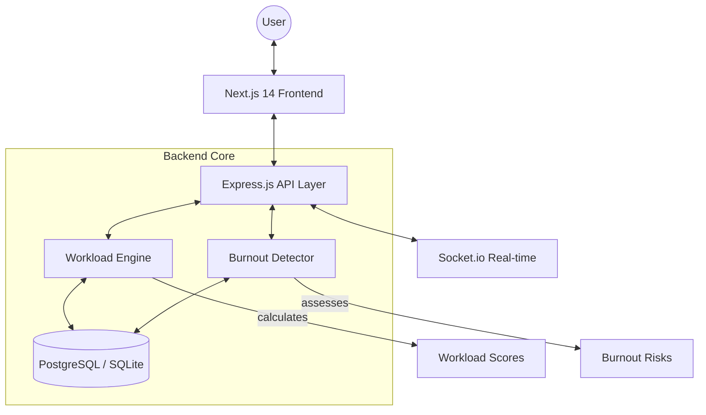

# 🛡️ Software Requirements Specification (SRS)
## SEAPM: Employee Task Overload & Burnout Detection System

[](LICENSE)
[](https://nextjs.org/)
[](https://nodejs.org/)
[](https://sqlite.org/)

---

## 📄 Executive Summary

**SEAPM** (Smart Employee Analytics & Performance Management) is an enterprise-grade, data-driven platform engineered to synchronize organizational productivity with employee psychological safety. By employing longitudinal burnout detection and multi-factor workload scoring, SEAPM shifts the paradigm from reactive management to proactive wellbeing intervention.

---

## 1. Introduction

### 1.1 Purpose
The purpose of this document is to provide a comprehensive description of the SEAPM system. It defines the functional and non-functional requirements for the platform, ensuring that all stakeholders (Developers, Managers, and Administrators) have a unified understanding of the system's objectives and operational constraints.

### 1.2 Project Scope
SEAPM is designed to monitor, analyze, and mitigate employee burnout. It provides:
- Real-time workload calculation based on task volume and complexity.
- Predictive burnout risk assessment using historical data trends.
- Hierarchical dashboards for Employees, Managers, and Administrators.
- Automated alerting mechanisms for critical workload thresholds.

### 1.3 Definitions and Acronyms
| Term | Definition |
| :--- | :--- |
| **SEAPM** | Smart Employee Analytics & Performance Management System. |
| **Workload Score** | A normalized value (0-100) representing an individual's current professional load. |
| **Burnout Risk** | A longitudinal assessment of potential fatigue based on sustained high workload. |
| **RBAC** | Role-Based Access Control (Employee, Manager, Admin). |

---

## 2. Overall Description

### 2.1 Product Perspective
SEAPM operates as a standalone web application utilizing a decoupled architecture. It provides a bridge between task management systems and HR wellbeing initiatives, focusing specifically on the human cost of productivity.

### 2.2 Product Functions
- **Authentication**: Secure multi-role login with JWT-based session management.
- **Task Management**: CRUD operations for tasks with priority and effort estimation.
- **Analytics Engine**: Real-time calculation of workload and burnout metrics.
- **Reporting**: Visual trend analysis and team-wide pulse checks.
- **System Configuration**: Dynamic threshold adjustment for risk levels.

### 2.3 User Classes and Characteristics
1.  **Employee**: Primary data contributors. Focus on task completion and personal wellbeing tracking.
2.  **Manager**: Oversees teams. Focus on load balancing and preventing team exhaustion.
3.  **Administrator**: System owners. Focus on organization-wide metrics and system integrity.

### 2.4 Operating Environment
- **Client**: Modern web browsers (Chrome, Firefox, Safari, Edge).
- **Server**: Node.js 18+ environment.
- **Database**: SQLite (Development) / PostgreSQL compatible logic.

---

## 3. System Features (Functional Requirements)

### 3.1 Core Security & Access (RBAC)
- **Requirement**: The system must enforce strict role-based access.
- **Features**: 
  - Password encryption using `bcrypt`.
  - Token-based authentication using `JSON Web Tokens (JWT)`.
  - Middleware-level route protection for sensitive admin/manager endpoints.

### 3.2 Intelligent Workload Scoring Engine
The system calculates a **Workload Score ($W_s$)** using the following weighted factors:

$$W_s = (V \times 0.25) + (P \times 0.25) + (D \times 0.25) + (H \times 0.25)$$

Where:
- **V (Volume)**: Ratio of active tasks to user capacity.
- **P (Priority)**: Weighted sum of high-priority assignments.
- **D (Deadline)**: Proximity pressure (Overdue = Max impact).
- **H (Hours)**: Estimated effort relative to the 40-hour standard week.

### 3.3 Longitudinal Burnout Detection
Unlike snapshot metrics, burnout is detected over a **7-day rolling window**:
- **Persistence**: 3+ consecutive days with $W_s > 70$.
- **Volatility**: Sudden workload spikes ($ \Delta W_s > 25$ in 24h).
- **Backlog**: Accumulation of overdue tasks exceeding 20% of total volume.

### 3.4 Managerial Insights & Redistribution
- **Team Pulse**: Heatmaps showing workload distribution across the team.
- **Risk Identification**: Automated flagging of employees in the "High Risk" quadrant.
- **Redistribution Logic**: Data-driven recommendations for moving tasks from high-load to low-load members.

### 3.5 Real-time Communication & Notifications
- **Requirement**: The system must provide instant updates for critical alerts.
- **Features**: 
  - **Socket.io Integration**: Real-time push notifications for high-risk workload alerts.
  - **In-App Alerts**: Persistent notification center for longitudinal trend warnings.

---

## 4. Technical Architecture

### 4.1 System Diagram


### 4.2 Tech Stack Details
| Layer | Technology | Rationale |
| :--- | :--- | :--- |
| **Frontend** | Next.js 14 (App Router) | Server-side rendering for performance and SEO. |
| **Logic** | Node.js / Express.js | Scalable, event-driven architecture for real-time calculations. |
| **Real-time** | Socket.io | Low-latency bi-directional communication for alerts. |
| **Database** | PostgreSQL / SQLite | Robust relational storage with local-first dev support. |
| **Security** | Helmet.js / Rate-Limit / JWT | Enterprise protection including DDoS mitigation. |

---

## 5. Non-Functional Requirements

### 5.1 Performance
- **Latency**: API response times must remain below 200ms for standard queries.
- **Concurrency**: Support for 1000+ simultaneous socket connections.

### 5.2 Security & Privacy
- **Protection**: Implementation of `express-rate-limit` to prevent brute-force attacks.
- **Encryption**: Industry-standard bcrypt hashing for sensitive credentials.

### 5.3 Software Quality Attributes
- **Maintainability**: Modular code structure using Controller-Service patterns.
- **Reliability**: 99.9% uptime for the monitoring dashboard.
- **Usability**: Premium, HSL-based design system optimized for cognitive ease.

---

## 6. Installation & Deployment

### 6.1 Local Development Setup
1.  **Clone Repository**:
    ```bash
    git clone https://github.com/shivammane2007/Employee-Task-Overload-and-Burnout-Detection-System.git
    ```
2.  **Environment Configuration**:
    Create `.env` files in both `backend/` and `frontend/` using provided `.env.example` templates.
3.  **Dependency Installation**:
    ```bash
    # Backend
    cd backend && npm install
    # Frontend
    cd ../frontend && npm install
    ```
4.  **Run Application**:
    ```bash
    # Backend (Starts on port 5000)
    npm run dev
    # Frontend (Starts on port 3000)
    npm run dev
    ```

---

## 7. Future Roadmap

- [ ] **ML Integration**: Training models to predict burnout before it appears in workload scores.
- [ ] **Third-Party Sync**: Integration with Jira, Slack, and Microsoft Teams.
- [ ] **Mobile Application**: Native iOS/Android apps for real-time notifications.
- [ ] **Advanced Reporting**: Automated PDF generation for quarterly HR reviews.

---

## 📄 License
This project is licensed under the **MIT License**.

---
*Built with precision for organizational health.*
